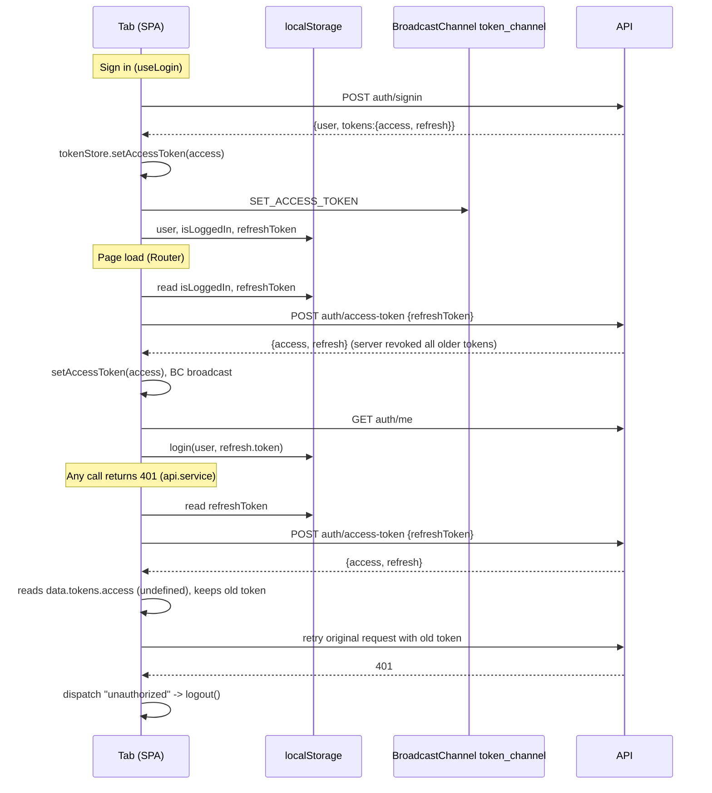

# Security and Access (frontend)

Reviewed against the code on 2026-10-01. This document covers how the SPA handles identity, tokens and untrusted data. **The server is the only security boundary.** Authentication, ownership checks, rate limits, S3 key scoping and the RSVP deadline are enforced in the backend and documented in the sibling repo's [`docs/SECURITY_AND_ACCESS.md`](../../ai-wedding-rsvp-generator-backend/docs/SECURITY_AND_ACCESS.md), referred to below as "the backend doc". Line numbers are as of this review.

## 1. Actors and routes

The SPA has no role concept, and neither does the API: every signed-in user is a host who can see only their own weddings.

| Route group | Who | Client gate | Real gate |
|---|---|---|---|
| `/`, `/signin`, `/signup`, `/verify-email`, `/forgot-password`, `/reset-password`, `/verification-pending`, `/blog*`, `/maintenance` | anyone | `/` and `/signin` redirect to `/weddings` when `isLoggedIn` ([router.tsx:50-56](../src/router.tsx#L50-L56), [:120-126](../src/router.tsx#L120-L126)) | public API routes |
| `/rsvp/:slug/:token`, `/rsvp/:token` | guest holding an invite link | none | `invite_token` lookup on the API |
| `/weddings`, `/profile` | host | pathless `AppLayout` loader redirects to `/signin` when `!isLoggedIn` ([router.tsx:135-141](../src/router.tsx#L135-L141)) | `authenticate` on every API call |
| `/wedding-dashboard`, `/guests`, `/guests/:id`, `/events`, `/page-settings`, `/invite-card`, `/guest-preview` | host with an active wedding | also `RequireWedding`, which only checks that `activeWeddingIdAtom` is set ([RequireWedding.tsx:18](../src/layout/RequireWedding.tsx#L18)) | per-endpoint ownership checks on the API |

`isLoggedIn` and `activeWeddingId` are plain `localStorage` values ([store.ts](../src/store/store.ts)); anyone can set them in devtools. The guards exist for navigation UX. Editing them gets you an empty shell whose API calls fail with 401 or 404. Never rely on a route guard, hidden button or disabled field to protect data. Any new capability needs a server-side check.

## 2. Token handling

### 2.1 Where things live

| Item | Storage | Lifetime | Source |
|---|---|---|---|
| Access token (+ `expires_at`) | memory only (`TokenService` singleton) | `JWT_ACCESS_EXPIRATION_MINUTES` (15 in the backend example env) | [token.ts](../src/store/token.ts) |
| Refresh token | `localStorage["refreshToken"]` via jotai `atomWithStorage` (JSON-encoded) | `JWT_REFRESH_EXPIRATION_DAYS` (30 in example) | [store.ts:7-10](../src/store/store.ts#L7-L10) |
| `user`, `isLoggedIn`, `activeWeddingId`, `activeWedding` | `localStorage` | until logout | [store.ts](../src/store/store.ts) |
| Theme | `localStorage["vite-ui-theme"]` | - | [ThemeProvider.tsx:30](../src/components/ThemeProvider.tsx#L30) |

The API returns tokens in JSON bodies and sets no cookies (backend doc §2.2). `VITE_COOKIE_BASED_AUTHENTICATION=true` therefore **does not work**. In that mode, login stores neither token ([use-auth.ts:56-62](../src/hooks/use-auth.ts#L56-L62)), and the backend still requires `refreshToken` in the body. Keep it `false` unless the backend gains httpOnly-cookie support.

### 2.2 Lifecycle

- Refresh on load: [router.tsx:244-263](../src/router.tsx#L244-L263). It stores both new tokens correctly.
- Refresh on 401: [api.service.ts:49-98](../src/api/api.service.ts#L49-L98). The response is read as `data.tokens.access` ([api.service.ts:67](../src/api/api.service.ts#L67)), but `POST auth/access-token` returns `data.access` / `data.refresh` (`GenerateNewTokenResponse`, [user.model.ts:37](../src/models/user.model.ts#L37)). The new access token is never applied, and the rotated refresh token is never persisted. The server has already revoked the old pair, so the retry fails and the user is logged out. This fails closed; see F1.
- `unauthorized` handler: `logout()` ([router.tsx:234-242](../src/router.tsx#L234-L242), [use-auth.ts:38-44](../src/hooks/use-auth.ts#L38-L44)) runs `localStorage.clear()` and clears the in-memory token. It does not call the API.
- Explicit logout: `POST auth/logout` with the refresh token, then local clear ([use-auth.ts:156-178](../src/hooks/use-auth.ts#L156-L178)). The server deletes every token of the user (backend doc §2.3).
- Single session: the server revokes all of a user's tokens on every signin and refresh. Signing in on a second device logs out the first.

### 2.3 Cross-tab sync

`TokenService` posts `SET_ACCESS_TOKEN` / `CLEAR_ACCESS_TOKEN` on the same-origin `BroadcastChannel("token_channel")`, and other tabs adopt the value ([token.ts:9-20](../src/store/token.ts#L9-L20), [:37-51](../src/store/token.ts#L37-L51)). `atomWithStorage` picks up `localStorage` changes from other tabs through `storage` events. Consequences:
- a refresh in any tab (e.g. opening a new tab, which runs the on-load refresh) revokes the old pair server-side and pushes the new access token to all tabs;
- logout in one tab clears the access token everywhere.
The channel carries the access token in plain form. Only same-origin script can join it, and that script could read `localStorage` anyway.

### 2.4 Trade-off: refresh token in localStorage

Any script running on the app origin can read the 30-day refresh token and mint access tokens until the user signs in again elsewhere or logs out. The in-memory access token limits exposure of the short-lived credential only. Mitigations currently in place: no HTML-injection sinks (§4), React escaping, and server-side revocation on logout, signin and refresh. Missing: a CSP (F3). The stronger design is an httpOnly `SameSite` cookie scoped to `/api/auth`. That needs the backend to set and read it, and CORS `credentials` are already enabled for the single origin.

## 3. Public RSVP page

- [Rsvp.tsx](../src/pages/Rsvp.tsx) calls `GET rsvp/:token` / `PUT rsvp/:token` ([use-rsvp.ts](../src/hooks/use-rsvp.ts)). The token in the URL is the guest's only credential. Anyone holding a forwarded link can read and change that reply until the deadline, which the API enforces; the `closed` flag in the page is display-only.
- The slug is cosmetic. The page redirects to the canonical slug returned by the API ([Rsvp.tsx:36-40](../src/pages/Rsvp.tsx#L36-L40)). RSVP and WhatsApp URLs are built by the backend, not here.
- Displayed data is limited to what the API selects (backend doc §4.1): guest name, own accommodation address, event and couple details, and signed image URLs that expire after `AWS_BUCKET_PUT_URL_EXPIRE`.
- Third parties that see the page URL: the embedded Google Maps iframe sets `referrerPolicy="no-referrer-when-downgrade"` ([EventLocationCard.tsx:35-41](../src/components/EventLocationCard.tsx#L35-L41)), so the full `/rsvp/<slug>/<token>` URL is sent to Google as `Referer` (F2). Directions links open in a new tab with `noreferrer`. Fonts and S3 images use the browser default `strict-origin-when-cross-origin`, which sends only the origin.
- If a host is signed in in the same browser, `api.service` also attaches their Bearer token to these public calls. The API ignores it on these routes.

## 4. XSS surface

- No `dangerouslySetInnerHTML`, `innerHTML`, `eval` or `new Function` in `src` (shadcn primitives excluded; checked 2026-10-01). All user-controlled text is rendered through JSX and escaped by React.
- `href`s built from data:
  - Google Maps search links use `encodeURIComponent` ([EventLocationCard.tsx](../src/components/EventLocationCard.tsx), [Rsvp.tsx](../src/pages/Rsvp.tsx) `StayCard`).
  - `wa.me` URLs come from the backend ([SendInvitesDialogue.tsx:77](../src/components/SendInvitesDialogue.tsx#L77), [GuestInviteCard.tsx:169-171](../src/components/GuestInviteCard.tsx#L169-L171)).
  - Generated images open with `noopener,noreferrer` ([DesignPreviewCard.tsx:84](../src/components/DesignPreviewCard.tsx#L84)).
  - React 19 blocks `javascript:` URLs in `href`.
- Blog content is static TypeScript ([posts.ts](../src/content/posts.ts)), not fetched HTML.
- There is no CSP or other security header for the SPA: no `public/_headers` for Cloudflare Pages, and none in [index.html](../index.html) (F3). The app can be framed by other sites.

## 5. Uploads and images

Images upload straight to S3. The SPA asks `general/generate-upload-url` for a presigned PUT, then `fetch(PUT)` sends the bytes ([general.service.ts:26-57](../src/api/general.service.ts#L26-L57)). The server rewrites every key under `users/<userId>/` and returns the final `object_key`, which is what must be saved. Keys the SPA proposes are timestamp-based ([ViewProfile.tsx:150](../src/pages/ViewProfile.tsx#L150), [PageSettingsIllustration.tsx:128](../src/components/PageSettingsIllustration.tsx#L128), [InviteCardMain.tsx:475](../src/components/InviteCardMain.tsx#L475)). Keys are not secrets, but this predictability matters for backend finding B1 (profile picture key not ownership-checked). Size and type limits in the UI are advisory; the backend doc lists the server-side gaps (B10).

## 6. Environment variables

Everything prefixed `VITE_` is compiled into the public JS bundle. Only put values there that are safe for anyone to read. Validation lives in [env.ts](../env.ts), and `node check-env.cjs` checks `.env` against `.env.example`. `.env` is git-ignored ([.gitignore](../.gitignore)).

| Variable | Exposure | Guidance |
|---|---|---|
| `VITE_APP_URL` | public | API base; no secret. |
| `VITE_COOKIE_BASED_AUTHENTICATION` | public | Keep `false` (§2.1). |
| `VITE_GOOGLE_MAPS_API_KEY` | **public**, used by Places autocomplete ([AddressAutocomplete.tsx:25](../src/components/custom/AddressAutocomplete.tsx#L25)) | In Google Cloud Console, restrict it to HTTP referrers `https://ai-wedding-rsvp-generator.pages.dev/*` (plus `http://localhost:5173/*` on a separate dev key), restrict the APIs to Maps JavaScript API and Places API, and set daily quotas and billing alerts. The RSVP map iframe (`maps.google.com/maps?...&output=embed`) does not use the key. |

## 7. Findings

| ID | Severity | Location | Description | Recommended fix |
|---|---|---|---|---|
| F1 | Low | [api.service.ts:67](../src/api/api.service.ts#L67) | The 401 refresh path reads `data.tokens.access`, but the API returns `data.access`/`data.refresh`. New tokens are discarded while the server has already revoked the old ones, so every mid-session access-token expiry ends in logout. Concurrent 401s also each start a refresh, and all but the first fail. It fails closed, so this is not exploitable, but it undercuts the refresh design. | Read `data.access`/`data.refresh`, persist the new refresh token through the same atom `login()` uses, and single-flight concurrent refreshes with a shared promise. |
| F2 | Low | [EventLocationCard.tsx:40](../src/components/EventLocationCard.tsx#L40) | On the public RSVP page the Maps iframe sends the full URL, including the invite token (the guest's credential), to Google as `Referer`. | Use `referrerPolicy="no-referrer"` (or `strict-origin-when-cross-origin`); the keyless embed does not need it. |
| F3 | Low | [store.ts:7-10](../src/store/store.ts#L7-L10), [index.html](../index.html) | The 30-day refresh token sits in `localStorage` with no CSP backstop and no framing protection. Today there are no HTML sinks, so this is exposure, not an active XSS. | Add `public/_headers` with a CSP (`script-src 'self'`, Google Maps/Fonts hosts, `connect-src` for the API and S3, `frame-src` Google Maps), `frame-ancestors 'none'`, `Referrer-Policy: strict-origin-when-cross-origin`, `X-Content-Type-Options: nosniff`. Longer term, move refresh to an httpOnly cookie. |
| F4 | Info | [AddressAutocomplete.tsx:25](../src/components/custom/AddressAutocomplete.tsx#L25) | The Maps key ships in the bundle by design; its safety depends on Console restrictions this repo can't enforce. | Apply the restrictions in §6 and record them in the deploy notes. |
| F5 | Info | [use-auth.ts:56-62](../src/hooks/use-auth.ts#L56-L62), [api.service.ts:56](../src/api/api.service.ts#L56) | `VITE_COOKIE_BASED_AUTHENTICATION=true` is a dead mode: the backend never issues cookies, so enabling it breaks sign-in. | Remove the flag, or implement cookie auth on both sides. |
| F6 | Info | [auth.validation.ts:5-18](../src/validations/auth.validation.ts#L5-L18) | Password rules (8-20 chars, character classes) exist only here. The 20-char cap is unusually low, and the server enforces nothing (backend B4). | Raise the max (bcrypt handles 72 bytes) and mirror one rule on the server. |

### Done well

- The access token is never persisted; it lives in memory and is shared across tabs over a same-origin channel.
- Logout clears all local state and the server-side tokens. The `unauthorized` event gives one central place to fail closed.
- No raw-HTML rendering anywhere. External links use `noopener`/`noreferrer`, and map queries are URL-encoded.
- Guest-facing URLs and WhatsApp messages are built by the backend, so the SPA can't produce links for invites it doesn't own.
- `useUserProfile` keys its cache by user id, so a second login in the same tab can't read the previous account's profile ([use-auth.ts:182-195](../src/hooks/use-auth.ts#L182-L195)).
- The sign-in form doesn't reveal the password rules ([auth.validation.ts:25-26](../src/validations/auth.validation.ts#L25-L26)).
- The SSE hook sends the Bearer header with `fetch` instead of putting the token in an `EventSource` query string ([use-wedding-live.ts:28-34](../src/hooks/use-wedding-live.ts#L28-L34)).

## 8. Security requirements for new features

- [ ] Treat route guards, `RequireWedding`, hidden buttons and form validation as UX only. Every new capability needs the matching server-side check (backend doc §8).
- [ ] Never render API or user data with `dangerouslySetInnerHTML`. If rich text is ever needed, sanitize with a vetted library and add a CSP first.
- [ ] Build external URLs with `encodeURIComponent` or take them from the backend. Links that open a new tab get `rel="noopener noreferrer"`.
- [ ] Pages whose URL carries a credential (`/rsvp/...`, `/verify-email?token=`, `/reset-password?token=`) must not embed third-party content that receives the full `Referer`. Use `referrerPolicy="no-referrer"` on iframes, images and links there.
- [ ] Don't put tokens, invite tokens or PII in query strings you create, in `console.*` output, or in analytics.
- [ ] Only the refresh token and non-sensitive UI state go in `localStorage`. Never store the access token, guest PII or signed URLs there.
- [ ] Every new `VITE_*` value is public. Add it to `env.ts` and `.env.example`, and if it's a third-party key, restrict it at the provider (referrer, API scope, quota).
- [ ] Save the `object_key` returned by `generate-upload-url`, never the key you proposed, and request view URLs only for keys you got from the API.
- [ ] New auth or token handling must match the backend response shapes in `src/models/user.model.ts` and must persist a rotated refresh token wherever it receives one.
