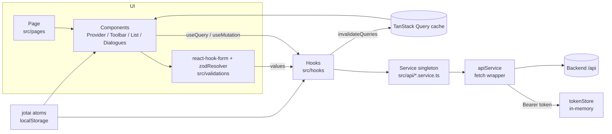
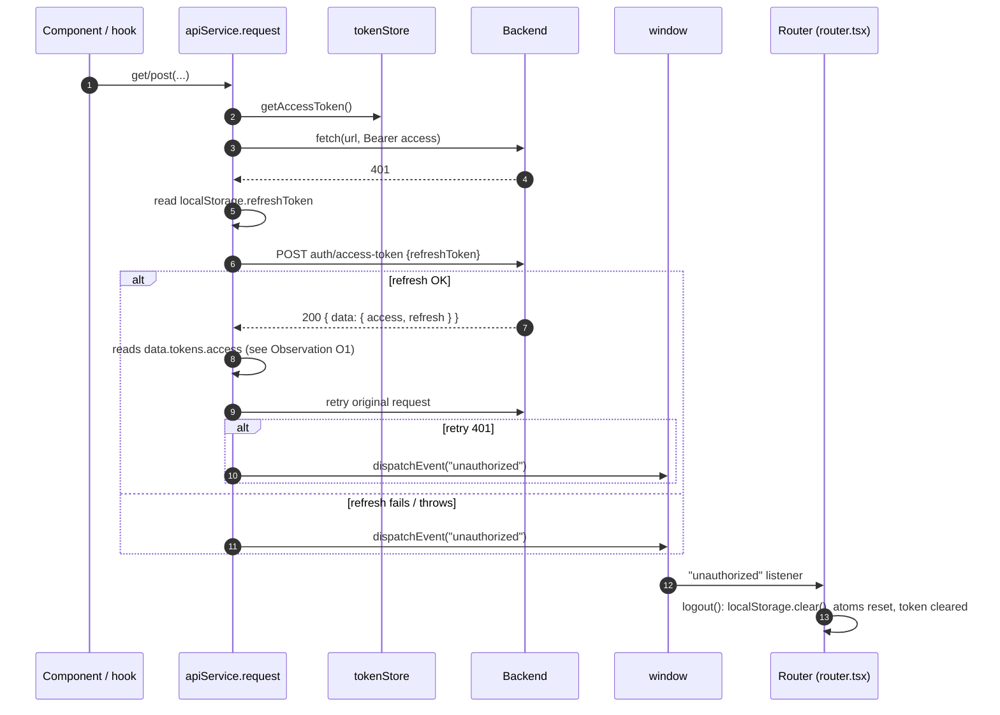
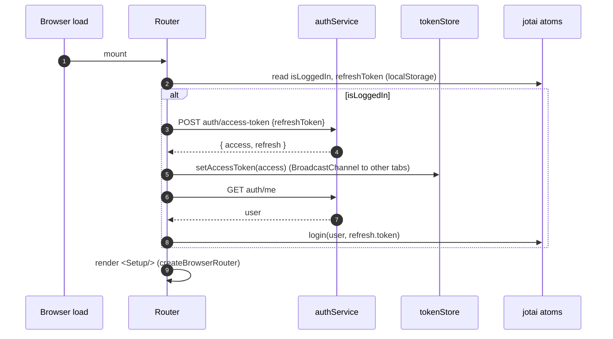

# Technical Architecture — WeddlyAI frontend

Status: describes the code as of 2026-10-01 (branch `dev`). Every statement links to the file it comes from. Where the code and the project notes disagree, the code wins and the gap is listed under [Observations](#12-observations).

Companion document: [FRONTEND_SPEC.md](./FRONTEND_SPEC.md) (look, behaviour, page-by-page spec).

---

## 1. Tech stack

Versions are the ranges declared in [package.json](../package.json).

### Runtime dependencies

| Concern | Package | Version | Where it is used |
|---|---|---|---|
| UI library | `react`, `react-dom` | ^19.2.6 | [main.tsx](../src/main.tsx) |
| Routing | `react-router-dom` | ^7.17.0 | [router.tsx](../src/router.tsx) (data router, `createBrowserRouter`) |
| Server state | `@tanstack/react-query` | ^5.101.2 | [main.tsx](../src/main.tsx), [src/hooks](../src/hooks) |
| Tables | `@tanstack/react-table` | ^8.21.3 | [guests/data-table.tsx](../src/components/guests/data-table.tsx) |
| Client state | `jotai` | ^2.20.1 | [store.ts](../src/store/store.ts) |
| Forms | `react-hook-form` | ^7.81.0 | every form component |
| Validation | `zod` | ^4.4.3 | [src/validations](../src/validations), [env.ts](../env.ts) |
| Form ↔ zod | `@hookform/resolvers` | ^5.4.0 | `zodResolver` in form components |
| Styling | `tailwindcss`, `@tailwindcss/vite` | ^4.3.0 | [index.css](../src/index.css), [vite.config.ts](../vite.config.ts) |
| Animations | `tw-animate-css` | ^1.4.0 | [index.css](../src/index.css) |
| Component kit | `shadcn` (CLI + `shadcn/tailwind.css`), `radix-ui` | ^4.11.0, ^1.5.0 | [components.json](../components.json), [src/components/ui](../src/components/ui) |
| Class helpers | `class-variance-authority`, `clsx`, `tailwind-merge` | ^0.7.1, ^2.1.1, ^3.6.0 | [utils.ts](../src/lib/utils.ts), [button.tsx](../src/components/ui/button.tsx) |
| Icons | `lucide-react` | ^1.33.0 | throughout |
| Charts | `recharts` | ^3.8.0 | [ResponseStatsChart.tsx](../src/components/ResponseStatsChart.tsx), [DietaryBreakDownChart.tsx](../src/components/DietaryBreakDownChart.tsx) |
| Toasts | `react-hot-toast` | ^2.6.0 | [main.tsx](../src/main.tsx), hooks |
| Avatars | `react-avatar` | ^5.0.4 | [UserMenu.tsx](../src/components/UserMenu.tsx), [ViewProfile.tsx](../src/pages/ViewProfile.tsx) |
| Image cropping | `react-easy-crop` | ^6.2.3 | [ImageCropper.tsx](../src/components/ImageCropper.tsx), [ViewProfile.tsx](../src/pages/ViewProfile.tsx) |
| Address search | `react-google-autocomplete` | ^2.7.5 | [AddressAutocomplete.tsx](../src/components/custom/AddressAutocomplete.tsx) |
| Fonts | `@fontsource-variable/geist`, `@fontsource-variable/bricolage-grotesque` | ^5.2.9, ^5.3.0 | [index.css](../src/index.css) |
| Env validation | `@julr/vite-plugin-validate-env` | ^2.2.2 | [env.ts](../env.ts), [vite.config.ts](../vite.config.ts) |

### Dev dependencies

| Concern | Package | Version |
|---|---|---|
| Bundler | `vite` | ^8.0.12 |
| React plugin | `@vitejs/plugin-react` | ^6.0.1 |
| Type checker | `typescript` | ~6.0.2 |
| Lint | `eslint`, `@eslint/js`, `typescript-eslint`, `eslint-plugin-react-hooks`, `eslint-plugin-react-refresh`, `globals` | ^10.3.0, ^10.0.1, ^8.59.2, ^7.1.1, ^0.5.2, ^17.6.0 |
| Types | `@types/react`, `@types/react-dom`, `@types/node`, `@types/google.maps`, `@types/babel__core` | ^19.2.14, ^19.2.3, ^24.13.2, ^3.65.2, ^7.20.5 |
| Installed, not wired in `vite.config.ts` | `babel-plugin-react-compiler`, `@babel/core`, `@rolldown/plugin-babel` | ^1.0.0, ^7.29.0, ^0.2.3 |

There is no test runner. [sse.ts](../src/lib/sse.ts) and [pageRange.ts](../src/lib/pageRange.ts) are written import-free so they can be exercised in isolation (comments in both files).

---

## 2. Directory layout

| Path | Contents |
|---|---|
| [index.html](../index.html) | Shell, static Open Graph tags (WhatsApp's crawler does not run JS, so every route previews with these), Inter font link |
| [env.ts](../env.ts) | zod schema for `VITE_*` variables, consumed by the validate-env Vite plugin |
| [check-env.cjs](../check-env.cjs) | Node script: every var in `.env` must appear in `.env.example` and in `env.ts` |
| [vite.config.ts](../vite.config.ts) | Plugins `react()`, `ValidateEnv()`, `tailwindcss()`; alias `@` → `src` |
| [components.json](../components.json) | shadcn config: style `radix-nova`, base colour `neutral`, CSS variables, icon library `lucide` |
| [src/main.tsx](../src/main.tsx) | `QueryClient` defaults, `<Router/>`, `<Toaster/>` |
| [src/router.tsx](../src/router.tsx) | The live router, auth bootstrap, `unauthorized` listener |
| [src/api](../src/api) | `apiService` fetch wrapper + one singleton service class per backend controller |
| [src/hooks](../src/hooks) | TanStack Query hooks per resource, SSE hook, `useIsMobile` |
| [src/models](../src/models) | Response/entity TypeScript types |
| [src/validations](../src/validations) | zod schemas + inferred form/request types |
| [src/store](../src/store) | jotai atoms (localStorage) and the in-memory access-token singleton |
| [src/layout](../src/layout) | `AppLayout` (sidebar shell) and `RequireWedding` guard |
| [src/contexts](../src/contexts) | `HeaderContext` (page title shown in the app bar) |
| [src/pages](../src/pages) | One file per route; thin composition of components |
| [src/components](../src/components) | Feature components (flat, PascalCase) |
| [src/components/ui](../src/components/ui) | shadcn primitives plus two local ones (`loader.tsx`, `multi-select.tsx`) |
| [src/components/custom](../src/components/custom) | Reusable inputs/widgets: `PhoneInput`, `PasswordInput`, `PasswordIndicator`, `AddressAutocomplete`, `MultiProgressBar`, `ScrollFade` |
| [src/components/guests](../src/components/guests) | Guest table columns, table, card list, shared guest field renderers |
| [src/components/auth](../src/components/auth) | `AuthLayout`, `AuthAside`, `AuthNotice` |
| [src/components/landing](../src/components/landing) | Marketing page sections, header, footer, sample data |
| [src/content/posts.ts](../src/content/posts.ts) | Static blog posts (5) and helpers (`getPost`, `readingMinutes`, `formatPostDate`) |
| [src/constants/index.ts](../src/constants/index.ts) | Sidebar nav, AI credit costs, dropdown option lists, `DIETARY_OPTIONS` |
| [src/lib](../src/lib) | Pure helpers: `cn`, date formatting, side/status colour maps, SSE parser, pager range, crop helper, clipboard helper |
| [src/utilities](../src/utilities) | `regex.ts` (password rules) and a second `cropImage.ts` |
| [public](../public) | `favicon.svg`, `icons.svg`, `og.jpg`, `indian_couple_cartoon.png` |

---

## 3. Layering per resource

Each backend resource is implemented as the same five-layer stack.

| Resource | Model | API service (controller prefix) | Hooks | Validation |
|---|---|---|---|---|
| Auth / user | [user.model.ts](../src/models/user.model.ts) | [auth.service.ts](../src/api/auth.service.ts) (`auth`) | [use-auth.ts](../src/hooks/use-auth.ts) | [auth.validation.ts](../src/validations/auth.validation.ts) |
| Wedding | [wedding.model.ts](../src/models/wedding.model.ts) | [wedding.service.ts](../src/api/wedding.service.ts) (`wedding`) | [use-wedding.ts](../src/hooks/use-wedding.ts), [use-wedding-live.ts](../src/hooks/use-wedding-live.ts) | [wedding.validation.ts](../src/validations/wedding.validation.ts) |
| Event | [event.model.ts](../src/models/event.model.ts) | [event.service.ts](../src/api/event.service.ts) (`event`) | [use-event.ts](../src/hooks/use-event.ts) | [event.validation.ts](../src/validations/event.validation.ts) |
| Guest / invites | [guest.model.ts](../src/models/guest.model.ts) | [guest.service.ts](../src/api/guest.service.ts) (`guest`) | [use-guest.ts](../src/hooks/use-guest.ts) | [guest.validation.ts](../src/validations/guest.validation.ts) |
| Page setting (RSVP page) | [pageSetting.model.ts](../src/models/pageSetting.model.ts) | [pageSetting.service.ts](../src/api/pageSetting.service.ts) (`page-setting`) | [use-pageSetting.ts](../src/hooks/use-pageSetting.ts) | [pageSetting.validation.ts](../src/validations/pageSetting.validation.ts) |
| AI invite card | [inviteCard.model.ts](../src/models/inviteCard.model.ts) | [inviteCard.service.ts](../src/api/inviteCard.service.ts) (`invite-card`) | [use-inviteCard.ts](../src/hooks/use-inviteCard.ts) | [inviteCard.validation.ts](../src/validations/inviteCard.validation.ts) |
| RSVP (public) | [rsvp.model.ts](../src/models/rsvp.model.ts) | [rsvp.service.ts](../src/api/rsvp.service.ts) (`rsvp`) | [use-rsvp.ts](../src/hooks/use-rsvp.ts) | none (form has no schema, see [RsvpForm.tsx](../src/components/RsvpForm.tsx)) |
| Uploads / signed URLs | inline in [general.service.ts](../src/api/general.service.ts) | [general.service.ts](../src/api/general.service.ts) (`general`) | `useGenerateUploadUrl`, `useGenerateViewUrl`, `useGetViewUrl` in [use-pageSetting.ts](../src/hooks/use-pageSetting.ts) | none |

Conventions enforced by the layers:

- All responses are `GenericResponse<T> = { success, statusCode, message, data }` ([generic.ts](../src/models/generic.ts)).
- Service classes are singletons holding `api = apiService` and a `controller` string; methods build the path and query string with `URLSearchParams` (e.g. [guest.service.ts](../src/api/guest.service.ts)).
- Request bodies must be assignable to `Record<string, unknown> | FormData` ([api.service.ts](../src/api/api.service.ts)); that is why request types are `type` aliases, e.g. `RsvpReply` ([rsvp.model.ts](../src/models/rsvp.model.ts)). Form value types are inferred from zod (`z.infer`) and passed straight to services (e.g. `GuestFormValues` → `guestService.addGuest`).
- Hook files export a `*_QUERY_KEY` constant; mutations invalidate keys and toast in `onSuccess`/`onError`.



### 3.1 Worked example: adding a guest

| Step | What happens | File |
|---|---|---|
| 1 | `/guests` renders `GuestProvider` → `Page` → `PageHeader title="Guests"` → `GuestToolbar actions={<GuestPrimaryButtons/>}` → `GuestList` → `GuestDialogues` | [Guests.tsx](../src/pages/Guests.tsx) |
| 2 | "Add guest" calls `setOpen("add")` on the provider context | [GuestPrimaryButtons.tsx](../src/components/GuestPrimaryButtons.tsx), [GuestProvider.tsx](../src/components/GuestProvider.tsx) |
| 3 | `GuestDialogues` renders `GuestActionDialogue mode="add" open={open === "add"}` and feeds it the wedding's events from `useGetEventsWithStatsInfinite(activeWeddingId, 20)` (paged, loaded on scroll inside the multi-select) | [GuestDialogues.tsx](../src/components/GuestDialogues.tsx) |
| 4 | Dialog builds `useForm<GuestFormValues>({ resolver: zodResolver(guestFormSchema) })` and resets to empty values every time it opens | [GuestActionDialogue.tsx](../src/components/GuestActionDialogue.tsx) |
| 5 | On submit zod validates (`eventIds` ≥1, name, mobile ≥8 digits, optional email or `""`, side, group, accommodation address required when `accomodation_required`, note ≤100) | [guest.validation.ts](../src/validations/guest.validation.ts) |
| 6 | `createGuest.mutate(values, { onSuccess: close })`; the dialog refuses to close while `isPending` | [GuestActionDialogue.tsx](../src/components/GuestActionDialogue.tsx) |
| 7 | `useCreateGuest.mutationFn` → `guestService.addGuest(body)` → `apiService.post("guest", body)` | [use-guest.ts](../src/hooks/use-guest.ts), [guest.service.ts](../src/api/guest.service.ts) |
| 8 | `apiService` JSON-encodes the body, sets `Authorization: Bearer <access>`, `fetch`es `${VITE_APP_URL}/guest` | [api.service.ts](../src/api/api.service.ts) |
| 9 | On success `invalidateGuestData(queryClient)` invalidates `["guests"]`, `["page-setting"]`, `["events"]`, `["wedding-dashboard"]` (guest counts appear on page settings, event cards and the dashboard), then `toast.success(response.message ‖ "New Guest Created Successfully")` | [use-guest.ts](../src/hooks/use-guest.ts) |
| 10 | Component-level `onSuccess` closes the dialog; `GuestList` refetches because its key starts with `"guests"` | [GuestList.tsx](../src/components/GuestList.tsx) |
| 11 | On error: `toast.error(error.message ‖ "Something went wrong! Please try again later")`, dialog stays open | [use-guest.ts](../src/hooks/use-guest.ts) |

---

## 4. HTTP client

[api.service.ts](../src/api/api.service.ts) — a class instance exported as `apiService`.

| Aspect | Behaviour |
|---|---|
| Base URL | `import.meta.env.VITE_APP_URL` (trailing slash stripped by [env.ts](../env.ts)); leading `/` on the endpoint is stripped |
| Methods | `get`, `post`, `put`, `patch`, `delete`, `download`. `post/put/patch` take a required `body` argument (`{}` when empty, e.g. `markInviteSent`) |
| Headers | `Content-Type: application/json`, removed when the body is `FormData` (guest Excel upload) |
| Auth | `Authorization: Bearer ${tokenStore.getAccessToken()}` when a token is held |
| Credentials | No `credentials` option is passed to `fetch` |
| Empty bodies | `204`, `content-length: 0` or an empty text body resolve to `undefined` |
| Errors | Non-2xx throws `Error(message ‖ error ‖ "HTTP error! status: N")` with `.status` (HTTP code) and `.type` (API error type) attached (`ApiRequestError`) |
| 401 handling | For any URL except `auth/access-token` and `auth/signin`: read `localStorage.refreshToken` (JSON-parsed; jotai stores it JSON-encoded), `POST auth/access-token` with `{ refreshToken }` (omitted in cookie mode), then retry the original request once. If refresh fails, or the retry is 401 again, dispatch `window` event `unauthorized` |
| `unauthorized` | Handled in `Router` ([router.tsx](../src/router.tsx)): calls `useAuth().logout()` which clears localStorage, atoms and the in-memory token |
| `download()` | Separate `fetch` with only the Bearer header, blob → object URL → temporary `<a download>`; no 401 refresh path |
| Direct S3 upload | `generalService.uploadFileToS3` `PUT`s the file to a presigned URL with plain `fetch` (no auth header) ([general.service.ts](../src/api/general.service.ts)) |



### 4.1 Auth bootstrap on page load

[router.tsx](../src/router.tsx), component `Router`:

1. Registers the `unauthorized` listener.
2. Runs `useQuery(["user", isLoggedIn])`. If the persisted `isLoggedInAtom` is true: `authService.getAccessToken(refreshToken)` → `tokenStore.setAccessToken(access)` → `authService.getUserInfo()` → `login(user, refresh.token)` (persists the rotated refresh token). Any failure → `logout()`.
3. While that query is loading, renders the full-screen `Loader`; afterwards renders `Setup`, which builds the router with `useMemo([isLoggedIn])` so route loaders see the current login state.



Login ([use-auth.ts](../src/hooks/use-auth.ts) `useLogin`): in token mode stores `tokens.access` in `tokenStore` and `tokens.refresh.token` in `refreshTokenAtom`, sets `userAtom`/`isLoggedInAtom`, navigates to `/weddings`, no success toast. Logout (`useLogout`): `POST auth/logout` with the refresh token, then local `logout()` and navigate to `/signin`.

---

## 5. State

### 5.1 Server state (TanStack Query)

`QueryClient` defaults ([main.tsx](../src/main.tsx)): `staleTime` 5 min, `gcTime` 10 min, `retry: 1`, `refetchOnWindowFocus: false`. Mutations use library defaults.

#### Query keys

| Key constant / prefix | Full key shape | Hook | File |
|---|---|---|---|
| `["user", isLoggedIn]` | same | bootstrap query in `Router` | [router.tsx](../src/router.tsx) |
| `["verifyEmail", token]` | same (`retry: false`) | `useVerifyEmail` | [use-auth.ts](../src/hooks/use-auth.ts) |
| `USER_PROFILE_QUERY_KEY = ["userProfile"]` | `["userProfile", userId]` | `useUserProfile` (feeds `useAiCredits`) | [use-auth.ts](../src/hooks/use-auth.ts) |
| `WEDDING_QUERY_KEY = ["weddings","weddings-stats"]` | `[...K, page, limit, search, ...filter, sortBy, sortOrder]` | `useGetWeddings` | [use-wedding.ts](../src/hooks/use-wedding.ts) |
| | `[...K, "infinite", limit, search, ...filter, sortBy, sortOrder]` | `useGetWeddingsInfinite` (AppLayout limit 20, WeddingSwitcher limit 5) | |
| | `[...K, "byId", id]` | `useGetWedding` | |
| | `[...K, page, limit, stats, search, ...filter, sortBy, sortOrder]` | `useGetWeddingsWithStats` (Weddings page) | |
| `["wedding-dashboard", weddingId]` | same | `useGetWeddingDashboard` | [use-wedding.ts](../src/hooks/use-wedding.ts) |
| `EVENT_QUERY_KEY = ["events"]` | `["events", weddingId, page, limit, search, side, sort]` | `useGetEventsWithStats` (Events page) | [use-event.ts](../src/hooks/use-event.ts) |
| | `["events", "infinite", weddingId, limit, stats]` | `useGetEventsWithStatsInfinite` (guest filters, guest dialog) | |
| `GUEST_QUERY_KEY = ["guests"]` | `["guests", page, limit, weddingId, search, events, sides, groups, inviteSent]` | `useGetGuests` | [use-guest.ts](../src/hooks/use-guest.ts) |
| | `["guests", id]` | `useGetGuest` (guest details) | |
| `WHATSAPP_INVITES_QUERY_KEY = ["whatsapp-invites"]` | `["whatsapp-invites", "eventId"‖"guestId", id]` | `useGetWhatsAppInvites` | [use-guest.ts](../src/hooks/use-guest.ts) |
| `REMINDERS_QUERY_KEY = ["reminders"]` | `["reminders", eventId]` | `useGetDueReminders` | [use-guest.ts](../src/hooks/use-guest.ts) |
| `PAGE_SETTING_QUERY_KEY = ["page-setting"]` | `["page-setting", "invite-formats", "infinite", weddingId, limit]` | `useGetGuestEventInviteFormatsInfinite` (RSVP page, Guest preview) | [use-pageSetting.ts](../src/hooks/use-pageSetting.ts) |
| `["view-url", objectKey]` | same, `staleTime` 5 min, `select` → URL | `useGetViewUrl` | [use-pageSetting.ts](../src/hooks/use-pageSetting.ts) |
| `INVITE_CARD_QUERY_KEY = ["invite-card"]` | `["invite-card", "cards", "infinite", weddingId]` | `useGetInviteCardsByWeddingInfinite` | [use-inviteCard.ts](../src/hooks/use-inviteCard.ts) |
| | `["invite-card", "generation-status", inviteCardId]` (polls every 3 s while `QUEUED`/`PROCESSING`) | `useInviteCardGenerationStatus` | |
| `RSVP_QUERY_KEY = ["rsvp"]` | `["rsvp", token]` (`retry: false`) | `useGetRsvp` | [use-rsvp.ts](../src/hooks/use-rsvp.ts) |

#### Invalidation map

`invalidateGuestData` = `["guests"]`, `["page-setting"]`, `["events"]`, `["wedding-dashboard"]` ([use-guest.ts](../src/hooks/use-guest.ts)).
`invalidateInviteCards` = `["invite-card"]`, `["page-setting"]` ([use-inviteCard.ts](../src/hooks/use-inviteCard.ts)).

| Mutation / trigger | userProfile | weddings | wedding-dashboard | events | guests | whatsapp-invites | reminders | page-setting | invite-card | rsvp | Toast |
|---|---|---|---|---|---|---|---|---|---|---|---|
| `useUpdateProfile` | x | | | | | | | | | | success + error; also writes `userAtom` |
| `useCreateWedding` / `useUpdatWedding` / `useDeleteWedding` | | x | | | | | | | | | success + error |
| `useCreateEvent` / `useUpdatEvent` / `useDeleteEvent` | | | | x | x | | | x | | | success + error |
| `useCreateGuest` / `useUpdateGuest` / `useDeleteGuest` (`invalidateGuestData`) | | | x | x | x | | | x | | | success + error |
| `useUploadGuestList` (`onSettled`, `invalidateGuestData`) | | | x | x | x | | | x | | | summary toast (see §7) |
| `useMarkInviteSent` | | | | | x | x | x | | | | error only |
| `useMarkReminderSent` | | | | | x | | x | | | | error only |
| `useSubmitGuestRsvp` (host sets a reply) | | | x | x | x | x | x | x | | | success + error |
| `useSubmitRsvp` (guest) | | | | | | | | | | x (also on 404) | success + error |
| `useUpdateGuestEventInviteFormat` | | | | | | | | x | | | success + error |
| `useGenerateImage` (`onSettled`) | x | | | | | | | | | | error only (caller toasts success) |
| `useUpdateInviteCard` (`invalidateInviteCards`) | | | | | | | | x | x | | success + error |
| Inline generate mutation, [InviteCardMain.tsx](../src/components/InviteCardMain.tsx) | x | | | | | | | x | x | | success / error |
| Generation settles (status effect, same file) | x (on FAILED) | | | | | | | x | x | | once per watched run |
| Own-card upload, [InviteCardMain.tsx](../src/components/InviteCardMain.tsx) | | | | | | | | x | x | | success / error |
| SSE connect, `rsvp` event, reconnect ([use-wedding-live.ts](../src/hooks/use-wedding-live.ts)) | | | x (this wedding) | | | | | | | | none |
| `useDownloadTemplate`, `useExportGuestList` | | | | | | | | | | | success + error |
| `useLogin`, `useRegister`, `useForgotPassword`, `useResetPassword`, `useResendEmailVerification`, `useLogout` | | | | | | | | | | | see [FRONTEND_SPEC.md](./FRONTEND_SPEC.md) |

Because keys are prefixes, invalidating `["guests"]` also refreshes a guest detail (`["guests", id]`), and invalidating `["weddings","weddings-stats"]` also refreshes `useGetWedding` (comment in [use-wedding.ts](../src/hooks/use-wedding.ts)).

### 5.2 Client state (jotai)

All atoms are `atomWithStorage` (localStorage, JSON-encoded) in [store.ts](../src/store/store.ts).

| Atom | localStorage key | Written by | Read by |
|---|---|---|---|
| `userAtom` | `user` | `login`, `logout`, `useUpdateProfile` | `UserMenu`, `ViewProfile`, `useUserProfile` (enables query) |
| `isLoggedInAtom` | `isLoggedIn` | `login`, `logout` | `Router`/`Setup` loaders, `ErrorState` |
| `refreshTokenAtom` | `refreshToken` | `login` | bootstrap, `useLogout`; `apiService` reads the raw localStorage key |
| `activeWeddingIdAtom` | `activeWeddingId` | `AppLayout` (auto-select), `WeddingSwitcher`, `WeddingCard`, `logout` | every wedding-scoped page and `RequireWedding` |
| `activeWeddingAtom` | `activeWedding` | `AppLayout` (kept in sync with `useGetWedding`, compared on `updated_at`), `WeddingSwitcher`, `WeddingCard` | `Header`, `Dashboard` countdown, `WeddingSwitcher` fallback |

Other client state:

| State | Where | Notes |
|---|---|---|
| Access token | [token.ts](../src/store/token.ts) `tokenStore` singleton | In memory only; `setAccessToken`/`clearAccessToken` post `SET_ACCESS_TOKEN`/`CLEAR_ACCESS_TOKEN` on `BroadcastChannel("token_channel")` so other tabs mirror it |
| Theme | [ThemeProvider.tsx](../src/components/ThemeProvider.tsx) | localStorage `vite-ui-theme`, default `dark` (set in [router.tsx](../src/router.tsx)) |
| Sidebar open | shadcn [sidebar.tsx](../src/components/ui/sidebar.tsx) | cookie `sidebar_state` (7 days); `AppLayout` defaults to open at ≥1024px when no cookie |
| Header title | [HeaderContext.tsx](../src/contexts/HeaderContext.tsx) | set by `PageHeader` in a layout effect, cleared on unmount |
| Page UI state | `GuestProvider`, `EventProvider`, `WeddingProvider` | dialog `open`, `currentRow`, search/filter/sort; not persisted |

---

## 6. Routing

[router.tsx](../src/router.tsx) is the only router (there is no `src/routes` directory). All pages except `Maintenance`, `NotFound` and `ErrorPage` are loaded with route-level `lazy`.

Root route: `RootLayout` = `ThemeProvider(defaultTheme="dark", storageKey="vite-ui-theme")` + `<Outlet/>`; `errorElement` renders `ErrorPage` inside the same provider.

| Path | Page file | Access | Extra |
|---|---|---|---|
| `/` | [Landing.tsx](../src/pages/Landing.tsx) | public | loader redirects to `/weddings` when logged in |
| `/blog` | [Blog.tsx](../src/pages/Blog.tsx) | public | readable signed in or out |
| `/blog/:slug` | [BlogPost.tsx](../src/pages/BlogPost.tsx) | public | unknown slug renders an in-page "not found" |
| `/signin` | [Login.tsx](../src/pages/Login.tsx) | public | loader redirects to `/weddings` when logged in |
| `/signup` | [Signup.tsx](../src/pages/Signup.tsx) | public | no logged-in redirect |
| `/verification-pending` | [EmailVerificationPending.tsx](../src/pages/EmailVerificationPending.tsx) | public | needs `location.state.email`, else `navigate("/")` |
| `/verify-email?token=` | [VerifyEmail.tsx](../src/pages/VerifyEmail.tsx) | public | |
| `/forgot-password` | [ForgotPasswod.tsx](../src/pages/ForgotPasswod.tsx) | public | filename typo is real |
| `/reset-password?token=` | [ResetPassword.tsx](../src/pages/ResetPassword.tsx) | public | no token → `navigate("/")` |
| `/rsvp/:slug/:token` | [Rsvp.tsx](../src/pages/Rsvp.tsx) | public | slug corrected client-side |
| `/rsvp/:token` | [Rsvp.tsx](../src/pages/Rsvp.tsx) | public | legacy links; redirected to slug URL |
| `/maintenance` | [Maintenance.tsx](../src/pages/Maintenance.tsx) | public | not linked from anywhere in `src` |
| `/weddings` | [AllWeddings.tsx](../src/pages/AllWeddings.tsx) | `AppLayout` | |
| `/profile` | [ViewProfile.tsx](../src/pages/ViewProfile.tsx) | `AppLayout` | |
| `/wedding-dashboard` | [Dashboard.tsx](../src/pages/Dashboard.tsx) | `AppLayout` + `RequireWedding` | SSE live updates |
| `/guests?event=` | [Guests.tsx](../src/pages/Guests.tsx) | `AppLayout` + `RequireWedding` | `?event` seeds the event filter |
| `/guests/:id` | [GuestDetails.tsx](../src/pages/GuestDetails.tsx) | `AppLayout` + `RequireWedding` | |
| `/events` | [Events.tsx](../src/pages/Events.tsx) | `AppLayout` + `RequireWedding` | |
| `/page-settings?event=` | [PageSettings.tsx](../src/pages/PageSettings.tsx) | `AppLayout` + `RequireWedding` | `?event` preselects |
| `/invite-card` | [InviteCard.tsx](../src/pages/InviteCard.tsx) | `AppLayout` + `RequireWedding` | `location.state.eventId` preselects |
| `/guest-preview` | [GuestPreview.tsx](../src/pages/GuestPreview.tsx) | `AppLayout` + `RequireWedding` | |
| `*` | [NotFound.tsx](../src/pages/NotFound.tsx) | public | |

Guards:

| Guard | Mechanism | File |
|---|---|---|
| Logged-out redirect | pathless route loader: `!isLoggedIn` → `redirect("/signin")` | [router.tsx](../src/router.tsx) |
| Logged-in redirect | loaders on `/` and `/signin` → `redirect("/weddings")` | [router.tsx](../src/router.tsx) |
| Active wedding required | `RequireWedding`: when `activeWeddingIdAtom` is null, renders an always-open dialog "Create a Wedding First"; closing it or clicking "Go to Weddings" navigates to `/weddings` | [RequireWedding.tsx](../src/layout/RequireWedding.tsx) |
| Session expiry | `unauthorized` window event → `logout()`; the router is rebuilt with `isLoggedIn=false`, so the next navigation hits the loader redirect | [router.tsx](../src/router.tsx) |

### 6.1 Active-wedding scoping

[AppLayout.tsx](../src/layout/AppLayout.tsx):

1. Loads the first page of weddings (`useGetWeddingsInfinite(20)`).
2. Loads the selected wedding by id (`useGetWedding(activeWeddingId)`), because the selection may be beyond the first page.
3. If no id is selected, or the selected wedding returns 404, selects `weddings[0]` (id and copy). Other errors keep the selection.
4. Keeps `activeWeddingAtom` equal to the server copy (compares `id` and `updated_at`).
5. Shows the full-screen `Loader` while the list loads, or while weddings exist but none is selected yet.

Every page under `RequireWedding` reads `activeWeddingIdAtom` and passes it to its hooks; switching wedding in the sidebar therefore changes every query key and refetches.

---

## 7. Background jobs and polling

| Job | Start | Poll | Finish | File |
|---|---|---|---|---|
| Excel guest import | `POST guest/template/upload/:weddingId` (FormData) → `202 { jobId }` | `pollJob`: `GET guest/import-status/:jobId` every 1.5 s | `completed` → `result: GuestImportResult`; `failed` → throws `failedReason`. Throws if still `waiting` after 30 s ("Is the backend worker running?") or after 5 min total (`ponytail:` fixed timeouts) | [use-guest.ts](../src/hooks/use-guest.ts) |
| AI invite card | `POST invite-card/generate-invite` → `{ inviteCardId, jobId, status }` | `useInviteCardGenerationStatus`: `GET invite-card/:id/generation-status` every 3 s while status is `QUEUED` or `PROCESSING` | `COMPLETED`/`FAILED` stops polling; the page invalidates card queries and toasts once per run it watched. `409` = run already in flight → page follows it; `402` → toast message | [use-inviteCard.ts](../src/hooks/use-inviteCard.ts), [InviteCardMain.tsx](../src/components/InviteCardMain.tsx) |
| RSVP illustration | `POST page-setting/generate-image` | none: synchronous request | returns `{ key }` | [pageSetting.service.ts](../src/api/pageSetting.service.ts) |

Import result toast ([use-guest.ts](../src/hooks/use-guest.ts)): 0 rows → "No guests found in the file"; all OK → "Imported N guest(s)"; partial → error toast listing up to 3 row errors, 8 s duration. Guest data is invalidated on settle because rows may be partially imported.

Invite-card generation survives reloads: the page reads `generation_status` from the card and resumes polling when it is in flight ([InviteCardMain.tsx](../src/components/InviteCardMain.tsx)).

---

## 8. Live updates (SSE)

[use-wedding-live.ts](../src/hooks/use-wedding-live.ts) is used only by [Dashboard.tsx](../src/pages/Dashboard.tsx).

| Aspect | Behaviour |
|---|---|
| Transport | `fetch(${VITE_APP_URL}/wedding/:id/live)` with `Authorization: Bearer`, because `EventSource` cannot send headers |
| Parsing | `response.body.pipeThrough(TextDecoderStream)`; chunks go through `parseSseChunk(buffer + value)` which splits on blank lines, reads `event:`/`data:` lines, drops comment-only blocks (heartbeats) and returns the unfinished tail as `rest` ([sse.ts](../src/lib/sse.ts)) |
| Reaction | Any message with `event === "rsvp"` invalidates `["wedding-dashboard", weddingId]`; the data payload is not read |
| Catch-up | Dashboard is invalidated on every (re)connect and before each retry |
| Retry | Exponential backoff 1 s → 30 s cap, reset after a successful connect |
| Status | Returns `connecting`, `live` or `reconnecting`, rendered by [RecentRsvpsCard.tsx](../src/components/RecentRsvpsCard.tsx) |
| Teardown | `AbortController` aborted on unmount or wedding change |

```mermaid
flowchart LR
  D[Dashboard] -->|useWeddingLive(id)| L[fetch /wedding/:id/live]
  L -->|stream| P[parseSseChunk]
  P -->|event: rsvp| I[invalidate wedding-dashboard,id]
  I --> Q[useGetWeddingDashboard refetch]
  L -->|error / end| R[status=reconnecting<br/>backoff 1s..30s]
  R --> L
```

---

## 9. Uploads and signed URLs

Images are stored as S3 object keys; the browser uploads directly with a presigned URL and displays images through signed view URLs.

| Use | Object key prefix | Flow | File |
|---|---|---|---|
| Profile picture | `users/{userId}/profile_{ts}.jpg` | crop → `general/generate-upload-url` → PUT → `PATCH auth/me { profilePicture: key }` | [ViewProfile.tsx](../src/pages/ViewProfile.tsx) |
| RSVP illustration source photo | `raw-images/rsvp-raw-images/cropped_image_{ts}.jpg` | crop → upload → `raw_image` form field | [PageSettingsIllustration.tsx](../src/components/PageSettingsIllustration.tsx) |
| Invite card reference | `ai-invite-cards/raw-images/invitation-reference/{ts}-{name}` | upload → `referenceKey` form field | [InviteCardMain.tsx](../src/components/InviteCardMain.tsx) |
| Invite card couple photo | `ai-invite-cards/raw-images/invitation-character/{ts}-{name}` | upload → `characterKey` form field | [InviteCardMain.tsx](../src/components/InviteCardMain.tsx) |
| Own invitation card | `ai-invite-cards/uploaded/{ts}-{name}` | upload → `PATCH invite-card/:id { generated_invite_image_url, card_source: "UPLOAD" }` | [InviteCardMain.tsx](../src/components/InviteCardMain.tsx) |

Display: `useGetViewUrl(key)` caches per key for 5 min (`ponytail:` assumes URLs outlive that). `InviteCardMain` instead resolves three view URLs in an effect with `generalService.generateViewUrl`.

---

## 10. Environment, build, deploy, lint

| Item | Detail | File |
|---|---|---|
| `VITE_APP_URL` | required URL; trailing slash removed; must include `/api` | [env.ts](../env.ts), [.env.example](../.env.example) |
| `VITE_GOOGLE_MAPS_API_KEY` | optional; Places autocomplete in address fields | [AddressAutocomplete.tsx](../src/components/custom/AddressAutocomplete.tsx) |
| Validation | `ValidateEnv()` plugin in dev and build, schema from `env.ts` (`validator: "standard"`) | [vite.config.ts](../vite.config.ts) |
| Consistency check | `node check-env.cjs`: exits 1 if a `.env` var is missing from `.env.example` or `env.ts` | [check-env.cjs](../check-env.cjs) |
| Scripts | `dev` (vite), `build` (`tsc -b && vite build`), `lint` (`eslint .`), `preview` | [package.json](../package.json) |
| TypeScript | `target es2023`, bundler resolution, `noUnusedLocals`, `noUnusedParameters`, `erasableSyntaxOnly`, `verbatimModuleSyntax`; types `vite/client`, `google.maps`; no explicit `strict` flag | [tsconfig.app.json](../tsconfig.app.json) |
| Lint | Flat config: `@eslint/js` recommended, `typescript-eslint` recommended, react-hooks recommended, react-refresh (vite). `only-export-components` allows constants and a named list (`useEvent`, `useGuest`, `useTheme`, `useWedding`, `useHeader`, `useFormField`, `useSidebar`, `badgeVariants`, `buttonVariants`, `tabsListVariants`, `getSideBadgeStyles`, `formatSide`) | [eslint.config.js](../eslint.config.js) |
| Local preview | `.claude/launch.json` config `vite-dev` on port 5173 | [.claude/launch.json](../.claude/launch.json) |
| Deploy | Production is Cloudflare Pages at `https://ai-wedding-rsvp-generator.pages.dev` (OG URLs in `index.html`). The repo has no `wrangler` config or `_redirects`; deep links rely on the platform's default single-page-app fallback | [index.html](../index.html) |
| Stale-chunk recovery | A lazy chunk that 404s after a deploy lands in `ErrorPage`, whose "Reload" button is the documented escape hatch | [ErrorPage.tsx](../src/pages/ErrorPage.tsx) |

---

## 11. Conventions

| Convention | Detail |
|---|---|
| `ponytail:` comments | Mark deliberate shortcuts with their ceiling and upgrade path. Current ones: fixed job-poll timeouts ([use-guest.ts](../src/hooks/use-guest.ts)), signed-URL cache lifetime ([use-pageSetting.ts](../src/hooks/use-pageSetting.ts)), relative times only refresh on refetch ([RecentRsvpsCard.tsx](../src/components/RecentRsvpsCard.tsx)), chart colours repeat after 5 slices ([DietaryBreakDownChart.tsx](../src/components/DietaryBreakDownChart.tsx)), no billing behind the pricing section ([PricingSection.tsx](../src/components/landing/PricingSection.tsx)), unreleased features in UpcomingSection ([UpcomingSection.tsx](../src/components/landing/UpcomingSection.tsx)), sample data frozen at module load ([sampleData.ts](../src/components/landing/sampleData.ts)) |
| File naming | Components and pages PascalCase; hooks `use-<x>.ts`; services `<x>.service.ts`; models `<x>.model.ts`; validations `<x>.validation.ts`; shadcn primitives kebab-case in `ui/` |
| Typo'd names to import as-is | [SerachBar.tsx](../src/components/SerachBar.tsx), [ForgotPasswod.tsx](../src/pages/ForgotPasswod.tsx); hook names `useUpdatEvent`, `useUpdatWedding`; type `DeletWeddingResponse`; schema `resendVerificaionEmailSchema`; field names `accomodation_required` / `accomodation_address`; `DIETARY_OPTIONS` value `NON_VEGETARAIN` mirrors the backend enum |
| Dialogue spelling | Feature dialogs use "Dialogue" (`GuestActionDialogue`, `WeddingDeleteDialogue`); shadcn primitive is `dialog.tsx` |
| Shared helpers outside components | Side colours ([eventSide.ts](../src/lib/eventSide.ts)), wedding identity colour ([weddingColor.ts](../src/lib/weddingColor.ts)), RSVP status colours ([rsvpStatus.ts](../src/lib/rsvpStatus.ts)) live in `lib/` so component files export only components (react-refresh rule) |
| Render-time state adjustment | Lists reset to page 1 on filter change and step back a page when the last row is deleted by comparing a key during render instead of in an effect ([GuestList.tsx](../src/components/GuestList.tsx), [EventList.tsx](../src/components/EventList.tsx), [WeddingList.tsx](../src/components/WeddingList.tsx)) |
| Container queries | Layout responds to content width (`@container/<name>`, `@min-[..rem]/<name>:`) so collapsing the sidebar re-lays pages out |
| Guest-facing URLs | RSVP and `wa.me` links come from the backend (`GET guest/invites/whatsapp` → `rsvp_url`, `whatsapp_url`), never built in the frontend ([GuestDetails.tsx](../src/pages/GuestDetails.tsx), [SendInvitesDialogue.tsx](../src/components/SendInvitesDialogue.tsx)) |

---

## 12. Observations

Found while reading; nothing here was changed.

| # | Observation | Evidence |
|---|---|---|
| O1 | The 401 refresh path reads `refreshData.data?.tokens?.access`, but `auth/access-token` returns `data: { access, refresh }` (the bootstrap in `router.tsx` destructures it that way, and the backend `generateAuthTokensService` returns `{ access, refresh }`). The new access token is therefore never stored, the retry reuses the expired header, and a mid-session expiry most likely ends in `unauthorized` → logout. The rotated refresh token is also not persisted, while the backend deletes the user's previous tokens on refresh. | [api.service.ts](../src/api/api.service.ts), [router.tsx](../src/router.tsx), [user.model.ts](../src/models/user.model.ts) (`GenerateNewTokenResponse = GenericResponse<Tokens>`), backend `src/services/token.service.ts`, `src/services/auth.service.ts` |
| O2 | Resolved (FE-003): the unused cookie-auth flag and its branches were removed; tokens are always sent in the request body. | [use-auth.ts](../src/hooks/use-auth.ts) |
| O3 | `logout()` calls `localStorage.clear()`, which also removes the theme preference (`vite-ui-theme`). The query cache is not cleared on logout (acknowledged in a comment on `useUserProfile`). | [use-auth.ts](../src/hooks/use-auth.ts) |
| O4 | Event mutations do not invalidate `["invite-card"]` (Invite Card lists events through that key), `["wedding-dashboard"]`, or the weddings list (`totalEvents`). Guest mutations do not invalidate the weddings list (`totalGuests`) or `["whatsapp-invites"]`. | [use-event.ts](../src/hooks/use-event.ts), [use-guest.ts](../src/hooks/use-guest.ts) |
| O5 | `useGetEventsWithStats` omits `stats` from its query key. | [use-event.ts](../src/hooks/use-event.ts) |
| O6 | `useGetGuests` has no `enabled: !!weddingId` guard (others do); in practice `RequireWedding` prevents a null id. | [use-guest.ts](../src/hooks/use-guest.ts) |
| O7 | `PageSettingListResponse` types `events` as a single object; callers treat it as an array. | [pageSetting.model.ts](../src/models/pageSetting.model.ts), [PageSettingMain.tsx](../src/components/PageSettingMain.tsx) |
| O8 | `CLAUDE.md` mentions `src/routes/index.tsx` (does not exist) and `useAiInviteCardGenerationStatus` (actual name `useInviteCardGenerationStatus`). `README.md` is the Vite template and says the React Compiler is enabled, but `vite.config.ts` only uses `react()`. | [CLAUDE.md](../CLAUDE.md), [README.md](../README.md), [vite.config.ts](../vite.config.ts) |
| O9 | Duplicate crop helpers: [lib/cropImage.ts](../src/lib/cropImage.ts) (used by `ImageCropper`) and [utilities/cropImage.ts](../src/utilities/cropImage.ts) (used by `ViewProfile`). | both files |
| O10 | Resolved (FE-008, FE-026): the unused dashboard card component, its menu constant, the unused toolbar component and the ignored delete-confirm callback were removed. | - |
| O11 | `index.html` loads Inter from Google Fonts; the CSS uses Geist and Bricolage Grotesque from `@fontsource`. | [index.html](../index.html), [index.css](../src/index.css) |
| O12 | `apiService.download()` has no 401 refresh; delete dialogs call `mutateAsync` without awaiting or catching. | [api.service.ts](../src/api/api.service.ts), [GuestDeleteDialogue.tsx](../src/components/GuestDeleteDialogue.tsx) |
